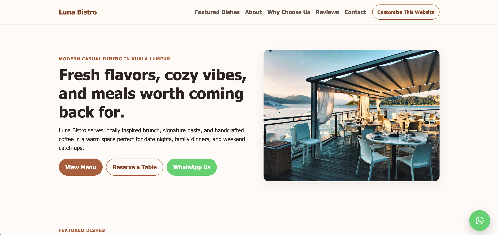
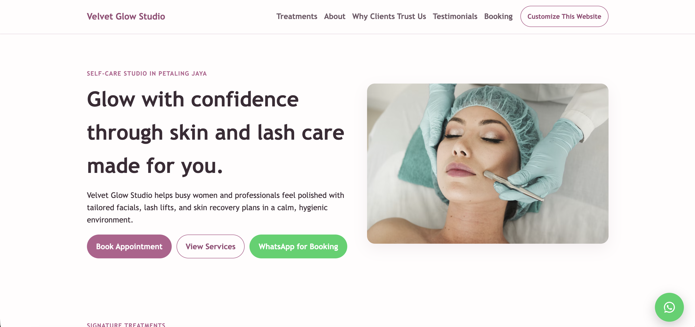
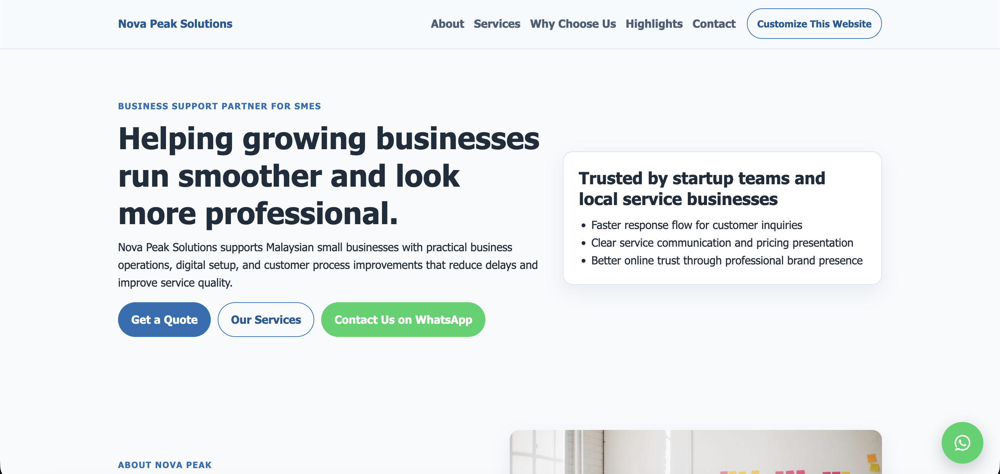

# Business Website Demos

[](https://wei041209.github.io/business-website-demos/)

A collection of simple business website demo templates built with plain HTML and CSS for small businesses.

This project is designed to:
- Demonstrate website design examples for small business niches
- Show potential clients the type of website they can get
- Provide template-like demos that are easy to adapt

## Live Demo

Explore the project on GitHub Pages:  
[https://wei041209.github.io/business-website-demos/](https://wei041209.github.io/business-website-demos/)

## Screenshots

Preview of the available demo websites included in this repository.

### Restaurant Demo


### Beauty Salon Demo


### Company Profile Demo


## Purpose

This repository serves as a portfolio project demonstrating simple business website designs for common small business categories such as restaurants, beauty salons, and company profile websites.

It can be used as:

- A design showcase
- Starter templates for small business websites
- Inspiration for freelance or agency projects

## Features

- Multiple business website demos in one repository
- Simple responsive layouts using plain HTML and CSS
- Clean landing page that lists available demos
- Easy-to-customize template structure
- Suitable for small business website showcases
- Useful as inspiration for client website projects

## Tech Stack

- HTML
- CSS
- GitHub Pages (hosting)
- Static website structure

## Project Structure

```bash
business-website-demos/
├── assets/
│   └── images/
├── beauty-salon-demo/
├── company-profile-demo/
├── restaurant-demo/
└── index.html
```

## How to Use

Clone the repository:

```bash
git clone https://github.com/wei041209/business-website-demos.git
```

Navigate to the project folder:

```bash
cd business-website-demos
```

Open `index.html` in your browser to explore the demo websites.

No build step or dependencies are required since this project uses plain HTML and CSS.

## Customization

- Update text, images, and branding in each demo folder to match your client or project needs
- Adjust styles in each demo's `style.css` file
- Modify layout sections in each demo's `index.html` file
- Add more demo folders and link them from the main `index.html` landing page

## License

This project is provided for portfolio and demonstration purposes only.

All rights reserved.

The source code may not be copied, modified, redistributed, or used for commercial purposes without permission from the author.
